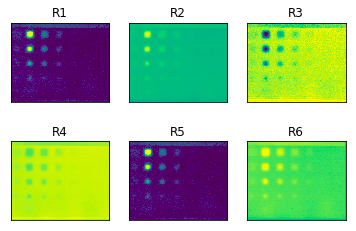
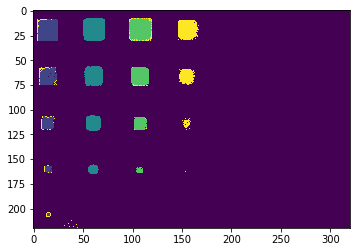

Extension of our final year project - " Signal processing approaches for noise reduction in pulsed thermography". 
The material has subsurface defects, the images were obtained using pulsed thermopraghy. We have 2 datasets, one with 250 images and other with 200 images. These are taken at t = 0.008s intervals. We introduce deep learning algorithms for 2 tasks given below.
### Objectives:
1. Improve SNR in thermal images: 
  - Use autoencoders to increase image SNR.  
  - Obatined ~20+ SNR(db) increase over other signal processing techniques.  
  
  - Some of the reconstructed images are show above. 
2. Obtain better defect detection/visibility: 
  - Using LSTM to visualize defects and identify depth one-shot in a test dataset. Preliminary results:
  
  - different colours correspond to different depths in the images. 
 
